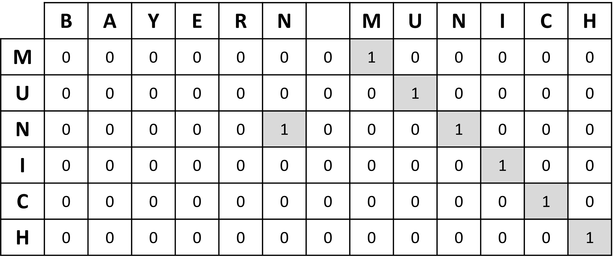

# StringPairFinder

StringPairFinder is a simple algorithm designed to match strings by similarity from different data sources. It streamlines the process of linking data by automating the comparison of strings, avoiding the need for manual work. This saves time for tasks such as data merging, deduplication, and information extraction.

<p align="center">
  
</p>

## Examples of use

*   **Encoding variables in datasets before a merge**: It is common to want to merge datasets from different sources, but to encounter difficulties when the variables used to identify records are not coded in the same way. Using StringPairFinder to link the variables before the merge can facilitate this process.

*   **Detection of duplicates in databases**: StringPairFinder can be used to detect duplicates in databases by matching and recoding strings that are mistakenly encoded differently.

*   **Searching for match between names and email addresses**: StringPairFinder can be used to link names and email addresses in databases. This can be useful for contact management or mass emailing.

*   **Searching for product similarity in online catalogs**: StringPairFinder can be used to link similar products in online catalogs. This can be used for tasks such as product recommendation or similar product search.

## How it works

The similarity search between two strings consists of a matrix comparison of each character in those strings. Let"s assume we want to compare the strings "Munich" and "Bayern Munich". 

1. The first step is to construct a table $T$ containing the first string in the column and the second in the row. The value of a cell is 1 if the character in the row is the same as the one in the column, and 0 otherwise.
<p align="center">
  
</p>

2. The second step aims at highlighting the fact that several characters correspond consecutively. Thus, for each row $i$ and column $j$, if cell $T[i-1, j-1] > 0$, then $T[i, j]$ is twice the value of $T[i-1, j-1]$.

<p align="center">
  
</p>

3. The third step is simply to calculate the similarity score, equal to the sum of all the cells in the $T$ divided by the size of the table.

$$ Score = \frac{\sum_{i=1}^{n_{row}}\sum_{j=1}^{n_{col}} T_{i,j}}{n_{row} * n_{col}}  = \frac{1+1+2+4+8+16+32}{78} \approx 0.82 $$

In this example, we obtain a similarity score of 64.

To connect the peers two by two, StringPairFinder calculates the similarity score of all (list1, list2) combinations and returns the association between each character string in list 1 with the character string in list 2 with the highest similarity score.

## Example with Python

Let's assume we have two lists of differently encoded teams. Applying StringPairFinder algorithm :

```python
list1 = ["Man City", "Ajaccio GFCO", "M'Gladbach", "Leverkusen", "Hertha", "Milan", "Sociedad", "Barcelona"]

list2 = ["AC Milan", "Real Sociedad", "Bayern Leverkusen", "Hertha Berlin", "Manchester City", "FC Barcelona", "GFC Ajaccio", "B. Monchengladbach"]

data = string_pair_finder.get_pairs(list1, list2)
print(data['list2'].to_dict())
```

```python
>> {"Man City": "Manchester City", "Ajaccio GFCO": "GFC Ajaccio", "M'Gladbach": "B. Monchengladbach",  "Leverkusen": "Bayern Leverkusen", "Hertha": "Hertha Berlin", "Milan": "AC Milan", "Sociedad": "Real Sociedad", "Barcelona": "FC Barcelona"}
```

## Example with R

Same example with R.

```r
list1 <- c("Man City", "Ajaccio GFCO", "M'Gladbach", "Leverkusen", "Hertha", "Milan", "Sociedad", "Barcelona")
list2 <- c("AC Milan", "Real Sociedad", "Bayern Leverkusen", "Hertha Berlin", "Manchester City", "FC Barcelona", "GFC Ajaccio", "B. Monchengladbach")

data = string_pair_finder::get_pairs(list1, list2)
print(data[, c('list1', 'list2')])
```

```r
         list1              list2
1        Milan           AC Milan
2     Sociedad      Real Sociedad
3   Leverkusen  Bayern Leverkusen
4       Hertha      Hertha Berlin
5     Man City    Manchester City
6    Barcelona       FC Barcelona
7 Ajaccio GFCO        GFC Ajaccio
8   M'Gladbach B. Monchengladbach
```

## Evaluation

The "evaluation" folder contains an example of the application of the algorithm and a comparison with an existing String Matching algorithm.

## Credits

This repository is maintained by Antoine PINTO (antoine.pinto1@outlook.fr).